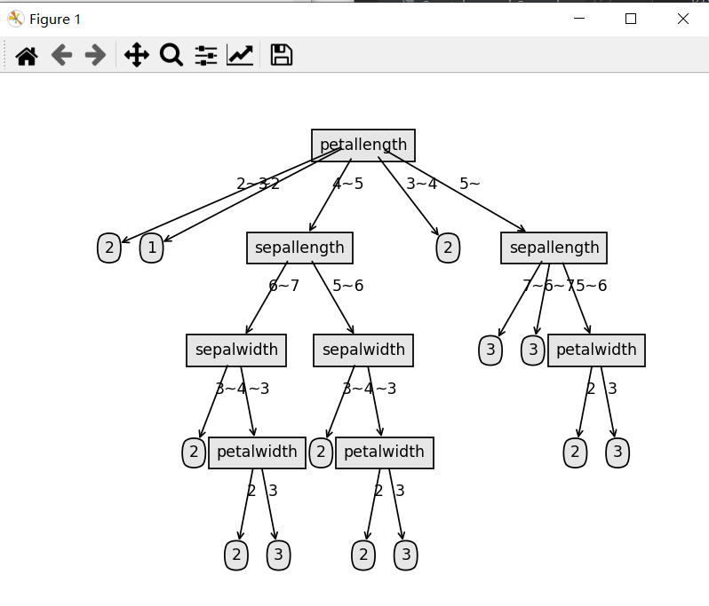
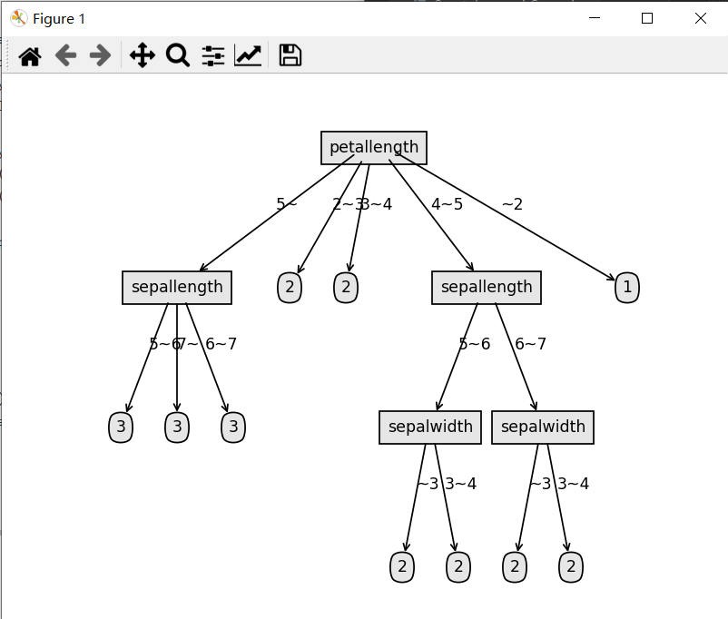
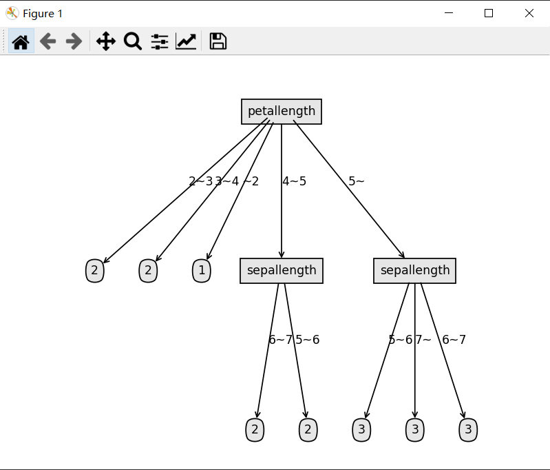
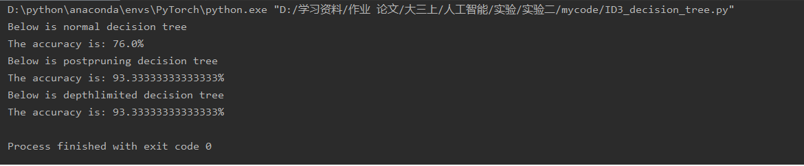

# ID3 Decision Tree

## Explanation of my code
This code uses the ID3 algorithm to build a decision tree. First, calculate the information entropy of the corresponding data.
```python3
# 计算信息熵
def informationentropy(dataset):

    num = len(dataset)
    labelCounts = {}

    for i in dataset:  # 遍历每个样本
        currentLabel = i[-1]  # 当前样本的类别
        if currentLabel not in labelCounts.keys():  # 生成类别字典
            labelCounts[currentLabel] = 0
        labelCounts[currentLabel] += 1
    info = 0.0

    for key in labelCounts:  # 计算信息熵
        prob = float(labelCounts[key]) / num
        info = info - prob * log(prob, 2)
    return info
```
Then the construction function divides the data set according to the selected attribute.
```python3
# 划分数据集，axis:按第几个属性划分，value:要返回的子集对应的属性值
def splitdataset(dataset, axis, value):

    spliteddataset = []

    for i in dataset:
        if i[axis] == value:
            reducedFeatVec = i[:axis]
            reducedFeatVec.extend(i[axis + 1:])
            spliteddataset.append(reducedFeatVec)

    return spliteddataset

```
On this basis, it is only necessary to complete the construction of the function to select the attribute with the maximum information gain, so as to realize the function of dividing the data set according to the attribute with the maximum information gain.
```python3
# 选择信息增益最大的属性
def choosebestfeature(dataset):

    numfeatures = len(dataset[0]) - 1  # 属性的个数
    baseentropy = informationentropy(dataset)
    bestInfoGain = 0.0
    bestfeature = -1

    for i in range(numfeatures):  # 对每个属性技术信息增益

        featList = [example[i] for example in dataset]
        uniqueVals = set(featList)  # 该属性的取值集合
        newEntropy = 0.0

        for value in uniqueVals:  # 对每一种取值计算信息增益
            subDataSet = splitdataset(dataset, i, value)
            prob = len(subDataSet) / float(len(dataset))
            newEntropy += prob * informationentropy(subDataSet)

        infoGain = baseentropy - newEntropy
        if (infoGain > bestInfoGain):  # 选择信息增益最大的属性
            bestInfoGain = infoGain
            bestfeature = i

    return bestfeature
```
Considering that the leaf node of the decision tree may need to be determined according to the largest number of labels, a function is built to return the labels with the largest number of occurrences.
```python3
# 通过排序返回出现次数最多的类
def majorclass(classList):
    classCount = {}
    for vote in classList:
        if vote not in classCount.keys():
            classCount[vote] = 0
        classCount[vote] += 1
    sortedClassCount = sorted(classCount.items(), key=operator.itemgetter(1), reverse=True)
    return sortedClassCount[0][0]
```
The decision tree can be constructed recursively.
```python3
# 递归构建决策树
def createtree(dataset, labels):
    classList = [example[-1] for example in dataset]  # 类向量

    if classList.count(classList[0]) == len(classList):  # 如果只有一个类，返回
        return classList[0]
    if len(dataset[0]) == 1:  # 如果所有特征都被遍历完了，返回出现次数最多的类
        return majorclass(classList)

    bestfeature = choosebestfeature(dataset)  # 最优划分属性的索引
    bestlabel = labels[bestfeature]  # 最优划分属性的标签

    ID3tree = {bestlabel: {}}

    del(labels[bestfeature])  # 已经选择的特征不再参与分类
    featValues = [example[bestfeature] for example in dataset]
    uniqueValue = set(featValues)  # 该属性所有可能取值，也就是节点的分支
    for value in uniqueValue:  # 对每个分支，递归构建树
        subLabels = labels[:]
        ID3tree[bestlabel][value] = createtree(splitdataset(dataset, bestfeature, value), subLabels)

    return ID3tree

```
Then draw the decision tree through matplotlib.
```python3
def classify(inputTree, featLabels, testVec):
    firstStr = list(inputTree.keys())[0]  # 根节点
    secondDict = inputTree[firstStr]
    featIndex = featLabels.index(firstStr)  # 跟节点对应的属性
    classLabel = None
    for key in secondDict.keys():  # 对每个分支循环
        if testVec[featIndex] == key:  # 测试样本进入某个分支
            if type(secondDict[key]).__name__ == 'dict':  # 该分支不是叶子节点，递归
                classLabel = classify(secondDict[key], featLabels, testVec)
            else:  # 如果是叶子， 返回结果
                classLabel = secondDict[key]
    return classLabel


def testtree(decisiontree, labels, testdata):
    total = len(testdata)
    right = 0

    for i in testdata:
        classified_lable = classify(decisiontree, labels, i)
        if classified_lable == i[4]:
            right += 1

    accuracy = right/total
    return accuracy


def plotNode(nodeTxt, centerPt, parentPt, nodeType):
    arrow_args = dict(arrowstyle="<-", connectionstyle="arc3", shrinkA=0, shrinkB=16)
    createPlot.ax1.annotate(nodeTxt, xy=parentPt,
                            xycoords='axes fraction',
                            xytext=centerPt, textcoords='axes fraction',
                            va="top", ha="center", bbox=nodeType,
                            arrowprops=arrow_args)


def getNumLeafs(myTree):
    numLeafs = 0
    firstStr = list(myTree.keys())[0]
    secondDict = myTree[firstStr]
    for key in secondDict.keys():
        if type(secondDict[key]).__name__ == 'dict':
            numLeafs += getNumLeafs(secondDict[key])
        else:
            numLeafs += 1
    return numLeafs


def getTreeDepth(myTree):
    maxDepth = 0
    firstStr = list(myTree.keys())[0]
    secondDict = myTree[firstStr]
    for key in secondDict.keys():
        if type(secondDict[key]).__name__ == 'dict':
            thisDepth = 1 + getTreeDepth(secondDict[key])
        else:
            thisDepth = 1
        if thisDepth > maxDepth:
            maxDepth = thisDepth
    return maxDepth


def plotMidText(cntrPt, parentPt, txtString):
    xMid = (parentPt[0] - cntrPt[0]) / 2.0 + cntrPt[0]
    yMid = (parentPt[1] - cntrPt[1]) / 2.0 + cntrPt[1]
    createPlot.ax1.text(xMid, yMid, s=txtString)


def plotTree(myTree, parentPt, nodeTxt):
    # 设置决策节点和叶节点的边框形状、边距和透明度，以及箭头的形状
    decisionNode = dict(boxstyle="square,pad=0.5", fc="0.9")
    leafNode = dict(boxstyle="round4, pad=0.5", fc="0.9")
    numLeafs = getNumLeafs(myTree)
    depth = getTreeDepth(myTree)
    firstStr = list(myTree.keys())[0]
    cntrPt = (plotTree.xOff + (1.0 + float(numLeafs)) / 2.0 / plotTree.totalW, plotTree.yOff)
    plotMidText(cntrPt, parentPt, nodeTxt)
    plotNode(firstStr, cntrPt, parentPt, decisionNode)
    secondDict = myTree[firstStr]
    plotTree.yOff = plotTree.yOff - 1.0 / plotTree.totalD
    for key in secondDict.keys():
        if type(secondDict[key]).__name__ == 'dict':
            plotTree(secondDict[key], cntrPt, str(key))
        else:
            plotTree.xOff = plotTree.xOff + 1.0 / plotTree.totalW
            plotNode(secondDict[key], (plotTree.xOff, plotTree.yOff), cntrPt, leafNode)
            plotMidText((plotTree.xOff, plotTree.yOff), cntrPt, str(key))
    plotTree.yOff = plotTree.yOff + 1.0 / plotTree.totalD


def createPlot(inTree):
    fig = plt.figure(1, facecolor='white')
    fig.clf()
    axprops = dict(xticks=[], yticks=[])
    createPlot.ax1 = plt.subplot(111, frameon=False, **axprops)
    plotTree.totalW = float(getNumLeafs(inTree))
    plotTree.totalD = float(getTreeDepth(inTree))
    plotTree.xOff = -0.5 / plotTree.totalW
    plotTree.yOff = 1.0
    plotTree(inTree, (0.5, 1.0), '')
    plt.show()

```
Next, consider pruning. Because there is no validation set for the iris dataset, it is better to prune later than building.
```python3
# 后剪枝(由于鸢尾花数据集无验证机不便预剪枝，且预剪枝可能会剪掉有用的子节点，故用后剪枝)
def postPruningTree(inputTree, dataset, datatest, labels):
    firstStr = list(inputTree.keys())[0]
    secondDict = inputTree[firstStr]
    classList = [example[-1] for example in dataset]
    featkey = copy.deepcopy(firstStr)
    labelIndex = labels.index(featkey)
    temp_labels = copy.deepcopy(labels)
    del(labels[labelIndex])
    for key in secondDict.keys():
        if type(secondDict[key]).__name__ == 'dict':
            if type(dataset[0][labelIndex]).__name__ == 'str':
                inputTree[firstStr][key] =postPruningTree(secondDict[key],
                                                           splitdataset(dataset, labelIndex, key),
                                                           splitdataset(datatest, labelIndex, key),
                                                           copy.deepcopy(labels))
            else:
                inputTree[firstStr][key] = postPruningTree(secondDict[key],
                                                           splitContinuousDataSet(dataset, labelIndex, featvalue, key),
                                                           splitContinuousDataSet(datatest, labelIndex, featvalue, key),
                                                           copy.deepcopy(labels))
    if testing(inputTree, datatest, temp_labels) <= testingMajor(majorclass(classList), datatest):
        return inputTree
    return majorclass(classList)
```
By adding a depth variable to recursion, the depth limit decision tree can be built.
```python3
# 限制深度的决策树
def createdepthlimitedtree(dataset, labels, maxdepth, depth):
    classList = [example[-1] for example in dataset]  # 类向量
    if classList.count(classList[0]) == len(classList):  # 如果只有一个类，返回
        return classList[0]
    if len(dataset[0]) == 1 or depth == maxdepth:  # 如果所有特征都被遍历完了，返回出现次数最多的类
        return majorclass(classList)

    bestfeature = choosebestfeature(dataset)  # 最优划分属性的索引
    bestlabel = labels[bestfeature]  # 最优划分属性的标签

    depthlimitedtree = {bestlabel: {}}

    del(labels[bestfeature])  # 已经选择的特征不再参与分类
    featValues = [example[bestfeature] for example in dataset]
    uniqueValue = set(featValues)  # 该属性所有可能取值，也就是节点的分支
    for value in uniqueValue:  # 对每个分支，递归构建树
        subLabels = labels[:]
        depthlimitedtree[bestlabel][value] = createdepthlimitedtree(splitdataset(dataset, bestfeature, value), subLabels, maxdepth, depth + 1)
    return depthlimitedtree
```
## Result
The different decision trees are shown below.
### The normal decision tree

### The cutted decisiontree

### The decisiontree whose depth is limited

### accuracy
Their accuracy is as below.
